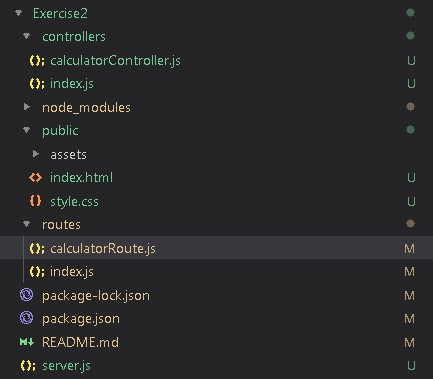
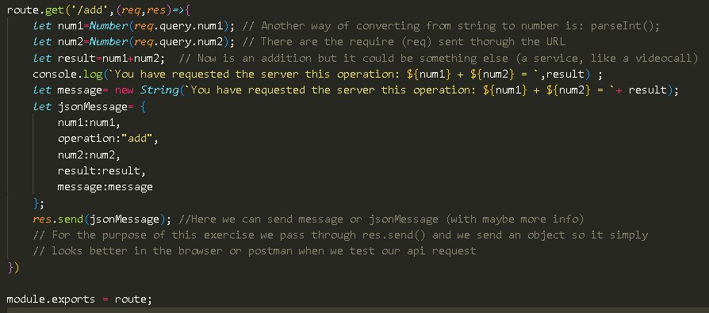
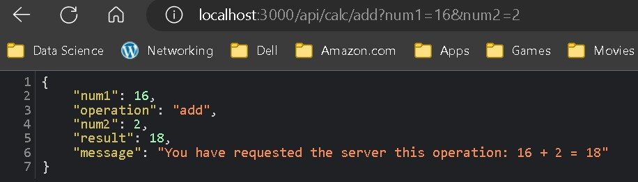

# Excersice 2

Thie is Exercise 2 from slide 36 of Module 5.Backend-Development. 

### Task: 
Using the code of Exercise1 as your starting point, create a full calculator
that is able to do the 4 different operations. 
#### Sub-tasks:

 - Create a Server.js file that uses expressJS to create 2 webservers: API & CLIENT. Client side will host the UI (html, css if a simple interface in the next exercise)
 - Using only the API server and app.use("/api/calc", calculatorRoute); to add a route (In the Routes folder) (See image below)
 

    
 

#### Solution:

Once server.js is created, the computation is written in the ***routes/calculatorRoute.js*** as shown below and in the code (read comments): 
  

    
 

This is an example of what the API call through the Web Browser looks like:

### Notes:
* Make sure to install express, nodemon and cors
* Run npm start which must "nodemon server.js"
